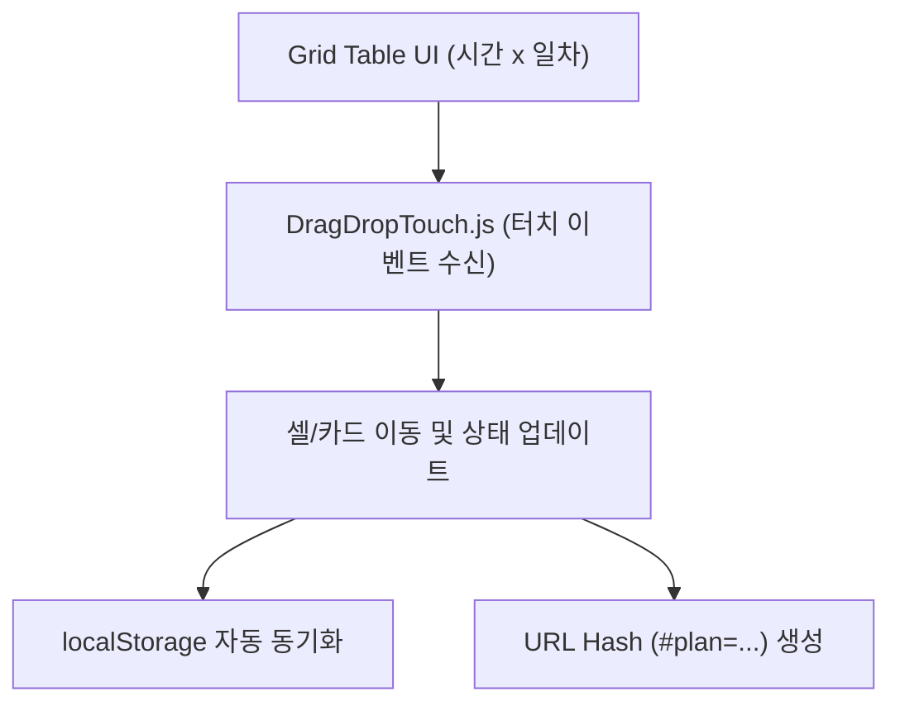

# 📘 Tour Time Planner - 시스템 아키텍처 및 상세 개발자 매뉴얼

본 문서는 **Tour Time Planner** 서비스의 타임라인 매트릭스 아키텍처, 데이터 저장/공유 프로토콜, 모바일 터치 드래그 연동 및 개발자 확장 방법을 다루는 서브 상세 설명서입니다.

---

## 🏗️ 1. 시스템 아키텍처 및 타임라인 Grid 구조

Tour Time Planner는 단일 HTML 파일(`index.html`) 내에 Tailwind CSS 및 Vanilla JavaScript 로직이 집약된 고성능 정적 웹 앱입니다.



### 📊 타임라인 데이터 구조 스키마
스케줄러의 모든 데이터는 아래와 같은 2D 매트릭스 형태 및 메타데이터로 관리됩니다:

```javascript
{
  "title": "도쿄 3박 4일 일정표",
  "startDate": "2026-08-16",
  "daysCount": 4,
  "cells": {
    "day-1-slot-0900": {
      "title": "도쿄 디즈니랜드 입장",
      "color": "#4f46e5",
      "icon": "ticket",
      "memo": "퍼레이드 시작 시간 확인",
      "mapUrl": "https://maps.google.com/..."
    }
  }
}
```

---

## 🖐️ 2. 터치 및 드래그 앤 드롭 (Mobile Touch Support)

모바일 브라우저(iOS Safari, Android Chrome)에서 기본 HTML5 Drag and Drop API가 동작하지 않는 문제를 해결하기 위해 **`DragDropTouch`** 폴리필을 통합하였습니다.

* **셀 단건 선택 & 드래그**: 클릭/터치 후 이동할 시간대 칸으로 떨어뜨려 간편하게 시간 변경 가능.
* **다중 선택 일괄 편집**: Shift 키 또는 드래그 선택을 통해 여러 시간 슬롯의 배경색, 아이콘, 메모를 한 번에 일괄 수정 가능.

---

## 💾 3. 지속성 및 공유 프로토콜

1. **로컬 자동 저장 (`localStorage`)**: 브라우저 창을 닫거나 새로고침하더라도 작성 중인 일정표가 자동으로 복원됩니다.
2. **URL 하이퍼링크 공유**: 일정표 전체 상태가 Base64 압축 형태로 URL에 반영되어 별도의 회원가입 없이 링크 하나로 공유 및 조회할 수 있습니다.

---

## 📄 4. 라이선스 및 상업적 연동 지침

본 프로젝트는 **CC BY-NC 4.0 (비영리)** 라이선스로 배포됩니다.
* **비영리/개인 사용**: 자유롭게 수정, 공유 및 활용 가능.
* **상업적 사용 (기업 서비스 탑재, 유료 연동, 대행업 등)**: 저작권자(`contact@ai-ing.org`)와 상업 라이선스 계약 필수.
